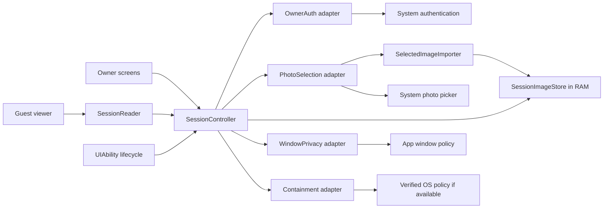
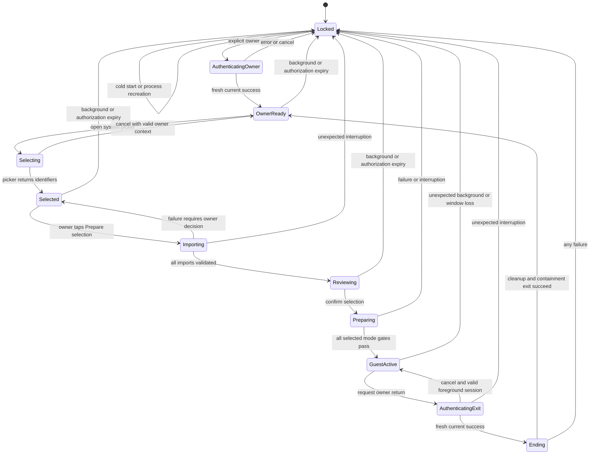

# BorrowPhone architecture

## 1. Product boundary

The MVP is a local, short-lived photo presentation session. The owner chooses exactly what a guest may see in BorrowPhone. The application must enforce that selection even if the guest swipes, presses Back, cancels authentication or causes the application to restart.

The intended product additionally prevents access to other phone data during handoff. That requires the separate containment feasibility gate in [02_SECURITY_AND_LOCKING.md](02_SECURITY_AND_LOCKING.md). Application authorization and OS navigation control are separate responsibilities.

### In scope

- One to five explicitly selected still photos; JPEG and PNG are the initial supported inputs.
- Owner authentication, system selection, selection review, guest viewing and authenticated return.
- Previous/next controls, image count and optional bounded pinch-to-zoom.
- Protected app windows, lifecycle handling, bounded image decoding and neutral error states.
- English UI for the contest demo, readable labels, large controls and accessible navigation.
- One ephemeral session at a time, entirely on the device.

### Deferred

Video, live/moving photos, animated media, editing, export, sharing, accounts, cloud storage, analytics, AI inference, persistent sessions, background services, cross-device transfer and arbitrary file browsing. HEIF/other formats may be added only after the core flow and decoder behavior are verified. Files and notes are subsequent phases.

There is no reason to introduce C++, React Native, a WebView or multiple app modules for this MVP. These are design choices, not restrictions imposed by HarmonyOS.

## 2. Screens and owner journey

| Screen | Visible actions | Authorization |
| --- | --- | --- |
| Locked start | Authenticate owner; neutral capability/error message | No media is shown |
| Owner selection | Choose photos; Prepare selection; review selected items; remove an item | Active owner authorization |
| Handoff preparation | Confirm exact count; show verified protection capability; start | Owner only |
| Guest viewer | Previous/next, count, optional zoom, Return to owner | Immutable session access only |
| Owner authentication | System prompt over a neutral app surface | Current pending attempt only |

The owner keeps the phone until preparation is complete and the guest screen is visible. The system picker is deliberately available only in owner mode: it can reveal the wider library while selecting, so it must never open during guest interaction.

The guest screen contains no gallery icon, picker, overflow menu, share target, external link, editable text or drag/export action. A hidden gesture is not the unlock mechanism. A visible Return to owner control opens a system authentication prompt.

If containment is unavailable, the owner preparation screen says: **“Viewer only. Other apps remain accessible.”** The implemented Oniro MVP follows this policy: its explicitly limited preview may continue, while no whole-phone handoff action or protection claim is offered.

## 3. Deployment and logical components

Use one Stage application, one entry HAP and one main UIAbility. The following are logical components inside that application, not separate processes or services. The Stage recommendation is supported by [Huawei's application-model guidance](https://developer.huawei.com/consumer/en/doc/harmonyos-guides-V14/application-models-V14).

| Component | Responsibility | Must not do |
| --- | --- | --- |
| SessionController | Own state, manifest, authorization epoch and all transitions | Trust a route or UI boolean as authority |
| Owner screens | Selection/review and explicit handoff | Stay reachable underneath guest navigation history |
| Guest viewer / SessionReader | Read an item from the current immutable manifest | Receive a general gallery repository or accept arbitrary URIs |
| PhotoSelection adapter | Open the native picker for an authorized owner | Enumerate the full library |
| SelectedImageImporter | Validate selected inputs and decode display images | Start external viewers or silently expand the selection |
| SessionImageStore | Keep prepared PixelMaps and minimal descriptors in RAM | Persist photos, source URIs or unlock state |
| OwnerAuth adapter | Request and interpret fresh system authentication | Store PINs, match biometrics or reuse previous device unlock |
| WindowPrivacy adapter | Apply/check protection before app pixels appear | Claim to control external system windows |
| Containment adapter | Report verified deployment capability and enter/leave it when supported | Self-assume enterprise privileges or treat fullscreen as confinement |
| UIAbility lifecycle adapter | Serialize background, foreground, recreation and window events | Restore owner authorization from saved UI state |

Small direct dependencies are sufficient. A dependency-injection framework, event bus, generic plugin system and database are unnecessary.

## 4. Data and permission flow

1. Start on a neutral locked screen. Establish window policy before rendering photos.
2. Authenticate the owner. Inspect required capabilities without reading the gallery.
3. Launch the system picker for images only, with an explicit limit of five. Check returned count again; do not trust UI filtering alone.
4. Accept only the returned selected identifiers into a pending draft. After the picker closes, show the owner a Prepare selection action. Do not open selected resources inside the picker callback; the version-specific read sequence is discussed in the API map.
5. On Prepare selection, validate and import. Reject duplicates, unexpected media types, excessive sizes and malformed or unreadable inputs. Read each selected item through a version-correct adapter and decode sequentially into a display-sized PixelMap. Apply orientation correctly. Release the ImageSource and close file descriptors after each import.
6. Review the resulting display images. If an item failed, do not silently begin a smaller session: show the failure and let the owner remove/replace it or explicitly accept a new selection.
7. Build a new immutable manifest. Remove source URI references from the guest-facing model. Removing a reference is not a claim of revoking an OS grant; grant lifetime is an SDK verification item [S2/S3 in the source register](SOURCES_AND_ASSUMPTIONS.md).
8. Revoke owner-mode authorization, clear owner routes, establish the applicable containment state and only then display the guest session. Any preparation error leaves a neutral/auth-required state.
9. Every guest read checks the current session generation and item membership. Swipe indices are clamped; an invalid item never causes a fallback to Gallery.
10. On authorized termination, invalidate the manifest first, release pixels and pending handles, then perform the supported containment exit procedure. Only successful completion permits an owner editing screen.

Do not use the external Gallery application to render selected photos. Native selection and internal rendering are distinct operations.

### Ephemeral model

| Concept | Fields, conceptually | Lifetime |
| --- | --- | --- |
| DraftSelection | Selected input identifiers, validation state | Owner preparation only |
| SessionManifest | Random session ID, generation, ordered opaque item IDs, count | One active session |
| SessionItem | Opaque ID, dimensions, media kind `photo`, RAM image handle | Current session |
| AuthAttempt | Attempt ID, challenge, purpose, current generation, pending status | One authentication operation |
| CapabilityReport | Authentication availability, privacy result, containment evidence/status | Current device/window instance |

Do not include source file paths, EXIF/GPS, gallery album names, authentication tokens or credentials in guest models or logs. Showing pixels alone avoids presenting metadata; it does not remove private information visibly photographed in the image.

### Resource budget

Proposed starting limits: five items, 25 MiB maximum compressed input per item, 50 megapixels maximum declared source dimensions, and 1,600 pixels on the longest display edge. These are tunable product limits to measure, not platform guarantees. Reject unsupported large content with a clear message.

Five square 1,600 x 1,600 RGBA images occupy about 49 MiB before framework/decoder overhead. Decode one input at a time at the target size; never intentionally allocate five full-resolution originals first. Budget total temporary/decoder memory separately and measure peak process usage. If the target cannot stay within a measured safe budget, lower the display dimension or item limit; do not silently start writing images to shared storage.

The baseline writes no image or session data to disk and offers no session restoration. Release native image resources deterministically. This is a data-minimization decision, not a promise of forensic RAM erasure. Verify UI framework caching does not introduce persistent media files.

## 5. Session state machine

`GuestActive` records its mode: restricted viewer preview or a separately validated contained deployment. The first is never labelled device-protected.

All transitions are serialized by SessionController. An authorization epoch increments whenever the session is invalidated. A late picker, decode or authentication callback must match both its operation ID and current epoch before it can change state.

Owner authorization lasts only for a short foreground setup transaction; start with a two-minute inactivity limit. Starting a guest session consumes it. No authorization survives a process restart. Rotation/window recreation must reapply privacy before pixels appear and cannot restore an owner screen merely from navigation history.

Distinguish an expected system picker/authentication modal from an unrelated background event. Register the expected operation before launching it, cover the app surface, and accept only its matching result. Unexpected backgrounding cancels the operation, invalidates authorization and ends the in-app session. A generic “ignore background while authenticating” flag is insufficient; verify real callback ordering. In kiosk deployments, losing the foreground must not trigger an unauthenticated kiosk-exit call.

After a lock/interruption, reentry shows a neutral owner-authentication gate. Do not restore an active guest session or owner authorization automatically. App state can fail closed even when device containment cannot; see the security document for that distinction.

## 6. Future files and notes

Preserve the same conceptual path: owner-mediated input -> bounded session content -> immutable manifest -> internal renderer. Add capabilities only when needed, without building a framework ahead of time.

**Files:** use DocumentViewPicker, initially support plain text and a carefully scoped PDF renderer. Enforce size/page limits and keep remote resources, hyperlinks, embedded attachments, scripts, export and external Open with actions disabled or outside scope. Rendering a document through another application breaks the session boundary. Larger files may justify sandbox storage and a separately designed encrypted, non-backed-up session cache; that is not part of the RAM-only MVP.

**Notes:** start with notes created or explicitly pasted/imported by the owner into BorrowPhone. Do not assume a public API can enumerate Huawei Notes or another app's private database. Guest mode is read-only, with no text selection/copy or link activation. If persistent owner notes are introduced, plan secure storage, backup policy and deletion separately.

Later, an owner-controlled second device could authorize a handoff or receive a selected-content session. This is optional research, not an MVP promise; it introduces pairing, trust, transport and revocation requirements that must be justified by a real use case.
