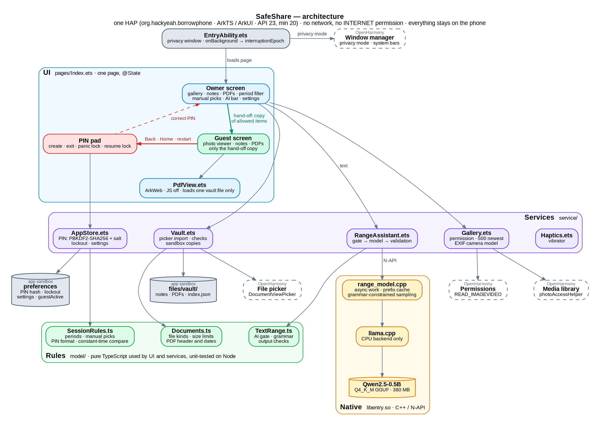
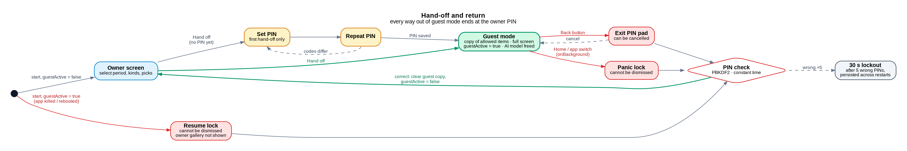
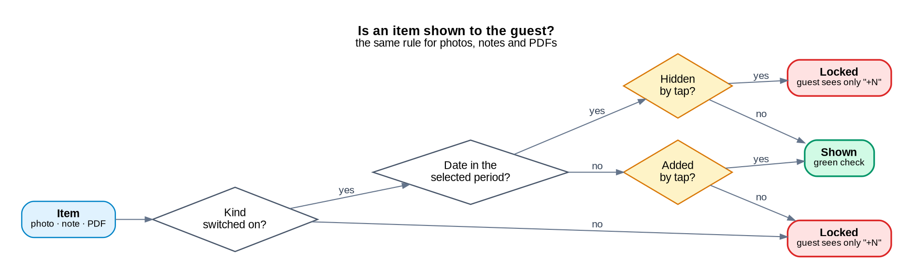
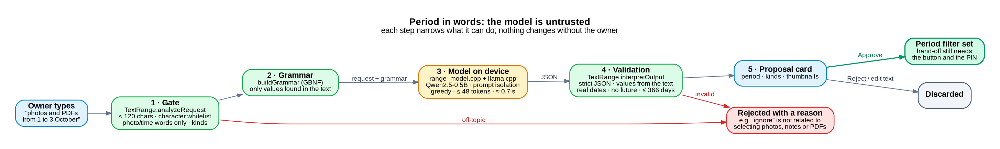

# SafeShare: architecture and implementation

SafeShare is a native OpenHarmony app that lets a phone owner hand the phone to someone else and show only chosen photos, notes and PDFs. The owner picks a time period, adjusts it by hand if needed, and starts a guest session. The guest sees only that selection. Leaving the session requires the owner's PIN.

This document describes the delivered code. `01_ARCHITECTURE.md`–`05_HACKATHON_COMPLIANCE.md` are the planning notes for the earlier MVP. The graphs are Graphviz sources in `diagrams/*.dot`; regenerate them with `for f in diagrams/*.dot; do dot -Tpng -Gdpi=150 "$f" -o "${f%.dot}.png"; done`.

## Platform and scope

| Item | Value |
| --- | --- |
| Technology | ArkTS / ArkUI, Stage model, one UIAbility, one HAP (`org.hackyeah.borrowphone`) |
| SDK | Compiled against API 23, compatible with API 20+, native ABIs `arm64-v8a` and `x86_64` |
| Permissions | `READ_IMAGEVIDEO` (gallery), `PRIVACY_WINDOW`, `VIBRATE` |
| Network | None. There is no `INTERNET` permission, no server and no account. All data and the AI model stay on the phone. |
| Security scope | App-level viewer. OpenHarmony does not let a normal app block Home/Recents, so other apps stay reachable. SafeShare locks itself and does not claim whole-device confinement. |

## Structure

The layers, top to bottom:
- **UI** (blue) is one ArkUI page.
- **Services** (purple) wrap the system kits.
- **Rules** (green, `model/`) hold every decision: what is shared, what counts as a valid PIN, file or AI answer. They have no platform imports, so they are tested on a laptop with Node.
- **Native** (amber) runs the language model.
- **Storage** (gray cylinders) lives in the app sandbox.
- **OpenHarmony system services** (dashed boxes) sit next to the code that calls them.

## Hand-off and return

- `enterGuest()` copies the allowed items into separate guest arrays, unloads the AI model, saves `guestActive = true` and switches to full screen. Guest screens are built only from those copies.
- Ways out of guest mode:
  - **Back** opens the PIN pad.
  - **Home or app switch:** `EntryAbility.onBackground` increments `interruptionEpoch`, and the page shows the panic lock.
  - **Killed app or reboot:** the next start finds `guestActive` set and opens straight into the resume lock.

Tapping a tile toggles that item, and the latest choice wins (`togglePick`). Long-pressing a photo opens a preview with a show/hide button.

## Components

- **Gallery (`Gallery.ets`).**
  - Requests `READ_IMAGEVIDEO` at runtime. After a denial it reopens the permission from system settings.
  - Reads up to 500 images, newest first, through `photoAccessHelper`, with only the columns it needs: date taken, size and title.
  - Reads the camera make and model from EXIF with `image.ImageSource`.
- **Notes and PDFs (`Vault.ets`, `Documents.ts`).**
  - Phone apps cannot list other apps' files, and picker URIs stay readable only briefly, so the owner imports files through `DocumentViewPicker`.
  - Checks on each file:
    - The extension must match the tab.
    - Notes must be strict UTF-8 text with no NUL bytes, at most 512 KB.
    - PDFs must have a `%PDF-` header and be at most 50 MB.
    - Duplicates are skipped, and the vault holds at most 200 files.
  - A valid file is copied to `files/vault/<uuid>` and recorded in `index.json`, which is written atomically (temp file, fsync, rename).
  - A PDF's date comes from its `/CreationDate`; otherwise the file's modification time is used.
- **PDF viewer (`PdfView.ets`).** ArkWeb's built-in PDF viewer with JavaScript, DOM storage, geolocation and online images turned off. `onLoadIntercept` blocks every URL except the one file, so links inside a PDF cannot open other vault files.
- **PIN and settings (`AppStore.ets`).**
  - Stores a 4-digit PIN as PBKDF2-SHA256 (100,000 iterations, 16-byte random salt), compared in constant time.
  - Five wrong attempts lock PIN entry for 30 s. The failure counter and lock time are persisted, so restarting the app does not reset them.
  - The same preferences store holds the theme, the leave alarm, guest photo details and the guest-session flag.
- **Window (`EntryAbility.ets`).** `setWindowPrivacyMode(true)` keeps the app out of system screenshots and screen recordings. Guest mode hides the status and navigation bars (`setSpecificSystemBarEnabled`).

## On-device AI period assistant

The owner can type "photos and PDFs from 1 to 3 October" instead of tapping dates.

- **Gate.** Chat-template tokens such as `<|im_start|>` cannot be typed. Off-topic text is rejected with the word that caused it. The gate, not the model, decides the item kinds.
- **Grammar.** The model can only answer `{"intent":"reject"}` or a period built from values that appear in the request text.
- **Prompt isolation.** The fixed instructions are tokenized with special tokens; the user's text is tokenized without them.

Native side:
- Inference runs in `napi_create_async_work`, off the UI thread.
- The model is loaded once, and the KV cache of the instruction prefix is kept between requests.
- Decoding is greedy with the grammar sampler, limited to 48 tokens, on 4 threads.
- `llama.cpp` is pruned to the CPU backend and built with `-O3`, plus AVX2/FMA on x86_64.
- Speed: about 0.7 s per request on a laptop CPU.
- The model (380 MB) is packed in the HAP or pushed to the emulator, then copied into the sandbox on first use.

## Platform capabilities used

| Kit | API | Purpose |
| --- | --- | --- |
| MediaLibraryKit | `photoAccessHelper` | Gallery query with date predicates |
| AbilityKit | `abilityAccessCtrl`, UIAbility lifecycle | Runtime permission; background detection for the guest lock |
| ArkUI | `window.setWindowPrivacyMode`, immersive mode, gestures | Screenshot protection, full-screen guest view, swipe, tap, long-press and zoom |
| CoreFileKit | `DocumentViewPicker`, `fileIo` | Note and PDF import, sandbox vault |
| ImageKit | `image.ImageSource` | EXIF camera model |
| ArkData | `preferences` | PIN hash, lockout, settings, session flag |
| CryptoArchitectureKit | `cryptoFramework` PBKDF2, CSPRNG | PIN hashing and salt |
| ArkWeb | `Web` with `onLoadIntercept` | Read-only PDF viewer |
| SensorServiceKit | `vibrator` | Haptic feedback for taps, lock and alarm |
| NDK | N-API + native C++ | On-device language model |

## Validation

- **Unit checks on Node 22**, with no emulator needed:
  - `tests/session_rules_test.mjs`: periods, weekend logic and manual picks.
  - `tests/text_range_test.mjs`: AI gate and output validation.
  - `tests/documents_test.mjs`: file kinds and PDF dates.
- **Host AI evaluation** (`tests/ai/`), using the same C++ inference code: 31/31 valid requests interpreted correctly, and 26/26 off-topic, injection or out-of-range requests rejected.
- **Device checks** on the OpenHarmony QEMU emulator, listed in `README.md`: permission flow, presets, manual picks and preview, PIN creation and lockout, Back/Home/force-stop during a guest session, the AI proposal flow, and note/PDF import.
- **Known limits:**
  - PDF rendering is not verified, because the x86_64 emulator ships ArkWeb for arm64 only.
  - Whole-device confinement is not implemented.
